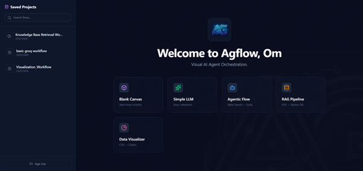
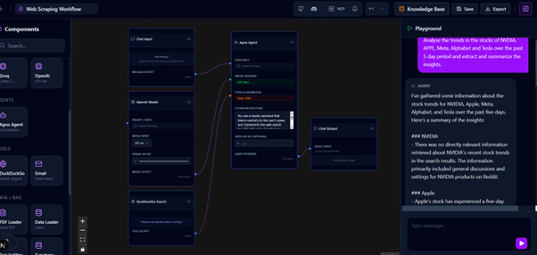
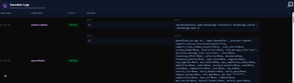
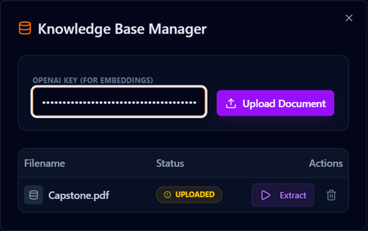
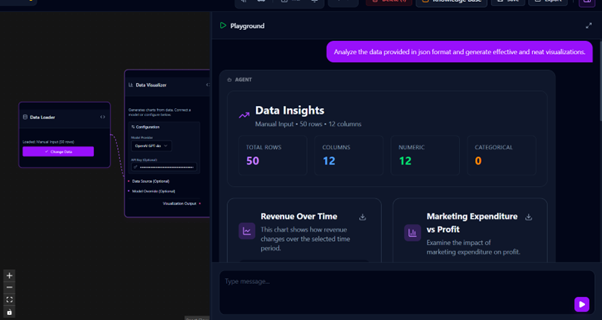
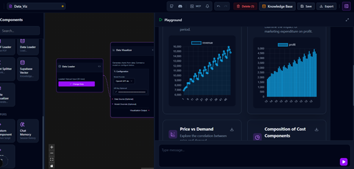
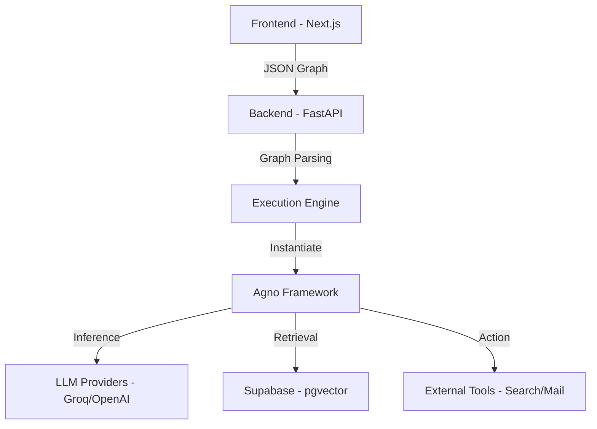

# Agflow: Visual AI Agent Orchestration


<div align="center">
  
  <p><em>Fig 1: Agflow Home Page</em></p>
</div>

Agflow is an open-source, low-code platform designed to build, test, and deploy Agentic AI workflows visually. Built on top of the Agno framework, it bridges the gap between drag-and-drop simplicity and code-first flexibility.

It allows developers to orchestrate LLMs, Tools, and RAG (Retrieval-Augmented Generation) pipelines using a node-based interface, while retaining the ability to inject custom Python logic dynamically.

## Table of Contents

- [Features](#features)
- [Architecture](#architecture)
- [Tech Stack](#tech-stack)
- [Getting Started](#getting-started)
  - [Prerequisites](#prerequisites)
  - [Installation](#installation)
- [Usage Guide](#usage-guide)
  - [Building Flows](#building-flows)
  - [RAG Pipelines (Knowledge Base)](#rag-pipelines-knowledge-base)
  - [Custom Python Components](#custom-python-components)
- [Deployment](#deployment)
- [Contributing](#contributing)
- [License](#license)

## Features

### 🧠 Agentic Workflows

- **Visual Builder**: Drag-and-drop interface powered by React Flow to connect Models, Agents, and Tools
- **Multi-Model Support**: Native integration with Groq (Llama 3, Mixtral) and OpenAI (GPT-4o)
- **Tool Integration**: Pre-built nodes for Web Search (DuckDuckGo), Gmail, Calculator, and Financial Data

<div align="center">
  
  <p><em>Fig 2: Web Scraping Pipeline</em></p>
</div>

<div align="center">
  
  <p><em>Fig 3: Execution Logs</em></p>
</div>

### 📚 Advanced RAG

- **Knowledge Base Manager**: Dedicated interface to upload, manage, and process documents (PDFs)
- **Vectorization**: Automatic chunking and embedding of documents into Supabase pgvector
- **Context Injection**: Seamlessly retrieve relevant context for Agents during inference

<div align="center">
  
  <p><em>Fig 4: Knowledge Base Management</em></p>
</div>

### 📊 Advanced Visualization & UX

- **Multi-Chart Dashboard**: Automatically generates multiple chart types (Bar, Line, Scatter, Pie) in a grid layout from a single dataset
- **Data Insights**: Interactive dashboard showing dataset statistics (rows, columns, numeric/categorical breakdown)
- **Enhanced Playground**: Resizable panel (up to 90% width) with a dedicated **Full Screen Mode** for immersive analysis
- **Code-First Data Nodes**: Edit the internal Python code of Data Loaders and Visualizers to implement custom parsing or advanced charting logic

<div align="center">
  
  
  <p><em>Fig 5 & 6: Data Visualization Dashboards</em></p>
</div>

### 🛠️ Code-First Extensibility

- **Custom Python Nodes**: Write raw Python code directly in the browser using the integrated Monaco Editor
- **Dynamic Compilation**: The backend parses your code signature (`def build(self, arg):`) and dynamically generates UI input handles on the canvas
- **Templates Library**: Built-in code snippets for common patterns (HTTP requests, String processing, Custom Agents)

### 💾 Productivity & Persistence

- **Auto-Save & History**: Real-time state tracking with Undo (Ctrl+Z) and Redo (Ctrl+Y) capabilities
- **Flow Management**: Save multiple projects to the cloud and switch between them instantly
- **Export to JSON**: Download your graph architecture for backup or sharing
- **Clipboard**: Copy (Ctrl+C) and Paste (Ctrl+V) nodes across the canvas

## Architecture

Agflow follows a Client-Server-Engine architecture:



- **Canvas (Frontend)**: Manages the visual graph state and user interactions
- **Orchestrator (Backend)**: Parses the node graph into a directed acyclic graph (DAG)
- **Execution Engine**: Dynamically instantiates Python classes (Agents, Tools) based on the graph topology and executes the logic securely

## Tech Stack

| Component | Technology | Description |
|-----------|------------|-------------|
| Frontend | Next.js 15 | App Router, Server Components, TypeScript |
| UI Library | Shadcn/UI | Tailwind CSS, Radix Primitives, Lucide Icons |
| Graphing | React Flow | Node-based interactive diagramming |
| Backend | FastAPI | High-performance Python API |
| AI Framework | Agno | (Formerly Phidata) Agent & RAG orchestration |
| Database | Supabase | PostgreSQL, Auth, Storage, and pgvector |
| Editor | Monaco Editor | VS Code-like editing experience in the browser |

## Getting Started

### Prerequisites

- Node.js 18+ & Python 3.10+
- A Supabase project (Free tier works)
- API Keys for Groq and OpenAI

### Installation

#### 1. Clone the Repository

```bash
git clone https://github.com/yourusername/agflow.git
cd agflow
```

#### 2. Database Setup (Supabase)

Run the following SQL in your Supabase SQL Editor to enable Vector support and tables:

```sql
-- Enable Vector Extension
CREATE EXTENSION IF NOT EXISTS vector;

-- Create Documents Table
CREATE TABLE documents (
  id UUID DEFAULT gen_random_uuid() PRIMARY KEY,
  user_id UUID REFERENCES auth.users NOT NULL DEFAULT auth.uid(),
  name TEXT NOT NULL,
  file_path TEXT NOT NULL,
  status TEXT DEFAULT 'uploaded',
  created_at TIMESTAMP WITH TIME ZONE DEFAULT NOW()
);

-- Create Flows Table
CREATE TABLE flows (
  id UUID DEFAULT gen_random_uuid() PRIMARY KEY,
  user_id UUID REFERENCES auth.users NOT NULL,
  name TEXT NOT NULL,
  data JSONB NOT NULL,
  created_at TIMESTAMP WITH TIME ZONE DEFAULT NOW()
);

-- Enable RLS (Row Level Security) policies for both tables...
```

#### 3. Backend Setup

```bash
cd backend
python -m venv venv
source venv/bin/activate  # On Windows: venv\Scripts\activate
pip install -r requirements.txt
```

Create a `.env` file (or set environment variables) in `backend/`:

```env
DB_URL=postgresql+psycopg://postgres:[PASSWORD]@[HOST]:5432/postgres
```

Run the server:

```bash
uvicorn main:app --reload
```

#### 4. Frontend Setup

```bash
cd frontend
npm install
```

Create a `.env.local` file in `frontend/`:

```env
NEXT_PUBLIC_SUPABASE_URL=https://your-project.supabase.co
NEXT_PUBLIC_SUPABASE_ANON_KEY=your-anon-key
NEXT_PUBLIC_API_URL=http://localhost:8000
```

Run the development server:

```bash
npm run dev
```

Visit [http://localhost:3000](http://localhost:3000) to access Agflow.

## Usage Guide

### Building Flows

1. **Add Nodes**: Drag components from the sidebar (left) to the canvas
2. **Connect**: Link the Right Handle (Output) of one node to the Left Handle (Input) of another
3. **Standard Pattern**: Chat Input → Model → Chat Output
4. **Agent Pattern**: Tools → Agent → Chat Output
5. **Execute**: Open the Playground (Right Panel), type a message, and hit Run

### RAG Pipelines (Knowledge Base)

To chat with your PDF documents:

1. Click **Knowledge Base** in the header
2. Enter your OpenAI API Key (required for embedding generation)
3. Upload a PDF
4. Click **Extract & Embed**. The status will change to "EMBEDDED"
5. On the canvas:
   - Add a **PDF Loader** node (select your file)
   - Connect it to a **Supabase Vector** node
   - Connect the Vector node to an **Agno Agent**

### Data Visualization

1. Add a **Data Loader** node (Load via CSV, JSON, URL, or Manual Text).
2. Connect it to a **Data Visualizer** node.
3. (Optional) Click the **Code `< >`** icon on the node header to customize the internal Python logic using the built-in Editor.
4. Run the flow to generate a **Multi-Chart Dashboard** in the Playground.
5. Use the **Maximize** button in the playground header to view charts in full screen.

### Custom Python Components

Agflow allows you to create nodes with arbitrary Python logic:

1. Drag a **Custom Component** node to the canvas
2. Click **Edit Code**
3. Define a class `CustomComponent` with a `build` method:

```python
class CustomComponent:
    def build(self, text: str, repeat: str) -> str:
        # Arguments become input handles
        return text * int(repeat)
```

4. Click **Save & Compile**. The node UI will update immediately to show inputs for `text` and `repeat`

## Deployment

### Backend (Render/Railway)

1. Push code to GitHub
2. Deploy the `backend/` folder as a Web Service
3. Set **Build Command**: `pip install -r requirements.txt`
4. Set **Start Command**: `uvicorn main:app --host 0.0.0.0 --port 10000`
5. Set **Environment Variables**: `DB_URL` and `FRONTEND_URL`

### Frontend (Vercel)

1. Import the repository to Vercel
2. Set **Root Directory** to `frontend`
3. Set **Environment Variables** (`NEXT_PUBLIC_API_URL` should point to your live backend)

## Contributing

Contributions are welcome! Please follow these steps:

1. Fork the repository
2. Create a feature branch (`git checkout -b feature/AmazingFeature`)
3. Commit your changes (`git commit -m 'Add some AmazingFeature'`)
4. Push to the branch (`git push origin feature/AmazingFeature`)
5. Open a Pull Request

## License

This project is licensed under the MIT License - see the [LICENSE](LICENSE) file for details.

---

**Built with ❤️ by Om**