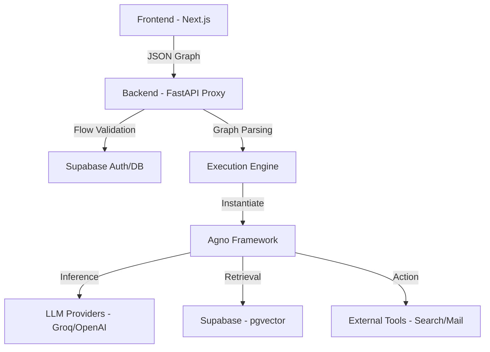

# Agflow: Visual AI Agent Orchestration


<div align="center">
  
  <p><em>Fig 1: Agflow Home Page</em></p>
</div>

Agflow is an open-source, low-code platform designed to build, test, and deploy Agentic AI workflows visually. Built on top of the Agno framework, it bridges the gap between drag-and-drop simplicity and code-first flexibility.

It allows developers to orchestrate LLMs, Tools, and RAG (Retrieval-Augmented Generation) pipelines using a node-based interface, while retaining the ability to inject custom Python logic dynamically.

## Table of Contents

- [Features](#features)
- [Architecture](#architecture)
- [Tech Stack](#tech-stack)
- [Getting Started](#getting-started)
  - [Prerequisites](#prerequisites)
  - [Installation](#installation)
- [Usage Guide](#usage-guide)
  - [Building Flows](#building-flows)
  - [RAG Pipelines (Knowledge Base)](#rag-pipelines-knowledge-base)
  - [Custom Python Components](#custom-python-components)
- [Deployment](#deployment)
- [Contributing](#contributing)
- [License](#license)

## Features

### 🚀 External API Access

- **Headless Execution**: Use your flows in external Python scripts or web apps via a secure REST API
- **Direct Credentials**: Access your unique **API Key** and **Flow ID** directly from the dashboard
- **Ready-to-Run Snippets**: Automatically generates hardcoded Python snippets for instant integration
- **Self-Healing Keys**: Automatic API key generation for all users to ensure seamless onboarding

<div align="center">
  
  <p><em>Fig 7: External API Access Modal</em></p>
</div>

### 📚 Advanced RAG & Knowledge Base

- **Refined Document Management**: Improved UI for uploading and managing PDFs with real-time status tracking
- **Vectorization**: Automatic chunking and embedding of documents into Supabase pgvector using OpenAI embeddings
- **Context Injection**: Seamlessly retrieve relevant context for Agents during inference using dedicated Vector Store nodes

<div align="center">
  
  <p><em>Fig 4: Knowledge Base Management (Refined)</em></p>
</div>

### 📊 Advanced Visualization & UX

- **Multi-Chart Dashboard**: Automatically generates multiple chart types (Bar, Line, Scatter, Pie) in a grid layout from a single dataset
- **Data Insights**: Interactive dashboard showing dataset statistics (rows, columns, numeric/categorical breakdown)
- **Enhanced Playground**: Resizable panel (up to 90% width) with a dedicated **Full Screen Mode** for immersive analysis
- **Code-First Data Nodes**: Edit the internal Python code of Data Loaders and Visualizers to implement custom parsing or advanced charting logic

### 🛠️ Code-First Extensibility

- **Custom Python Nodes**: Write raw Python code directly in the browser using the integrated Monaco Editor
- **Dynamic Compilation**: The backend parses your code signature (`def build(self, arg):`) and dynamically generates UI input handles on the canvas
- **Templates Library**: Built-in code snippets for common patterns (HTTP requests, String processing, Custom Agents)

### 💾 Productivity & Persistence

- **Auto-Save & History**: Real-time state tracking with Undo (Ctrl+Z) and Redo (Ctrl+Y) capabilities
- **Flow Management**: Save multiple projects to the cloud and switch between them instantly
- **Export to JSON**: Download your graph architecture for backup or sharing
- **Clipboard**: Copy (Ctrl+C) and Paste (Ctrl+V) nodes across the canvas

## Architecture

Agflow follows a Client-Server-Engine architecture:



- **Canvas (Frontend)**: Manages the visual graph state and user interactions
- **Next.js API Layer**: Handles authentication, API key validation for external calls, and proxies requests to the Python engine
- **Python Engine (FastAPI)**: Parses the node graph into a directed acyclic graph (DAG) and executes it using the Agno framework

## Tech Stack

| Component | Technology | Description |
|-----------|------------|-------------|
| Frontend | Next.js 15 | App Router, Server Actions, TypeScript |
| UI Library | Shadcn/UI | Tailwind CSS, Radix Primitives, Lucide Icons |
| Graphing | React Flow | Node-based interactive diagramming |
| Backend | FastAPI | High-performance Python API for execution |
| AI Framework | Agno | (Formerly Phidata) Agent & RAG orchestration |
| Database | Supabase | PostgreSQL, Auth, Storage, and pgvector |
| API Security | Admin API | Secure metadata-based API key management |
| Editor | Monaco Editor | VS Code-like editing experience in the browser |

## Getting Started

### Prerequisites

- Node.js 18+ & Python 3.10+
- A Supabase project with Vector extension enabled
- API Keys for Groq and OpenAI

### Installation

#### 1. Clone the Repository

```bash
git clone https://github.com/OmShah74/Agflow-AgenticAI.git
cd agflow
```

#### 2. Database Setup (Supabase)

Run the following SQL in your Supabase SQL Editor to enable Vector support and tables:

```sql
-- Enable Vector Extension
CREATE EXTENSION IF NOT EXISTS vector;

-- Create Documents Table
CREATE TABLE documents (
  id UUID DEFAULT gen_random_uuid() PRIMARY KEY,
  user_id UUID REFERENCES auth.users NOT NULL DEFAULT auth.uid(),
  name TEXT NOT NULL,
  file_path TEXT NOT NULL,
  status TEXT DEFAULT 'uploaded',
  created_at TIMESTAMP WITH TIME ZONE DEFAULT NOW()
);

-- Create Flows Table
CREATE TABLE flows (
  id UUID DEFAULT gen_random_uuid() PRIMARY KEY,
  user_id UUID REFERENCES auth.users NOT NULL,
  name TEXT NOT NULL,
  data JSONB NOT NULL,
  created_at TIMESTAMP WITH TIME ZONE DEFAULT NOW()
);
```

#### 3. Backend Setup

```bash
cd backend
python -m venv venv
source venv/bin/activate  # On Windows: venv\Scripts\activate
pip install -r requirements.txt
```

Create a `.env` file in `backend/`:

```env
DB_URL=postgresql+psycopg://postgres:[PASSWORD]@[HOST]:5432/postgres
SUPABASE_URL=https://your-project.supabase.co
SUPABASE_KEY=your-service-role-key  # Required for server-side logging
```

Run the server:

```bash
uvicorn main:app --reload
```

#### 4. Frontend Setup

```bash
cd frontend
npm install
```

Create a `.env.local` file in `frontend/`:

```env
NEXT_PUBLIC_SUPABASE_URL=https://your-project.supabase.co
NEXT_PUBLIC_SUPABASE_ANON_KEY=your-anon-key
SUPABASE_SERVICE_ROLE_KEY=your-service-role-key
NEXT_PUBLIC_API_URL=http://localhost:8000
NEXT_PUBLIC_APP_URL=http://localhost:3000
```

Run the development server:

```bash
npm run dev
```

## Usage Guide

### External API Access

To run your flows from any external application:

1.  **Save Your Flow**: Ensure your flow is saved to generate a unique ID.
2.  **Open API Modal**: Click the **API** button in the dashboard header.
3.  **Get Credentials**: Toggle the eye icon to see your `External API Key`.
4.  **Run Snippet**: Copy the generated Python code. It already includes your `FLOW_ID` and `API_KEY`.
5.  **Endpoint**: Your requests are proxied via `/api/v1/run/[flowId]` for secure, authenticated execution.

### RAG Pipelines (Knowledge Base)

1. Click **Knowledge Base** in the header.
2. Upload a PDF.
3. Click **Extract & Embed**. The status will change to "EMBEDDED" once processing is complete.
4. On the canvas:
   - Add a **PDF Loader** node (select your file).
   - Connect it to a **Supabase Vector Store** node.
   - Connect the Vector Store to an **Agent** to provide it with context.

## Deployment

### Backend (Render/Railway)

1. Deploy the `backend/` folder as a Web Service.
2. Set **Environment Variables**: `DB_URL`, `SUPABASE_URL`, and `SUPABASE_KEY` (Service Role).
3. Update `backend/main.py` with your frontend's production URL in the `origins` list.

### Frontend (Vercel)

1. Set **Root Directory** to `frontend`.
2. Configure **Environment Variables**:
   - `BACKEND_URL`: Your live backend URL.
   - `NEXT_PUBLIC_APP_URL`: Your Vercel deployment URL (e.g., `https://agflow.vercel.app`).
   - `SUPABASE_SERVICE_ROLE_KEY`: Your project's service role key for API validation.

## Contributing

Contributions are welcome! Please fork the repo and submit a PR for any features or bug fixes.

---

**Built with ❤️ by Om**
